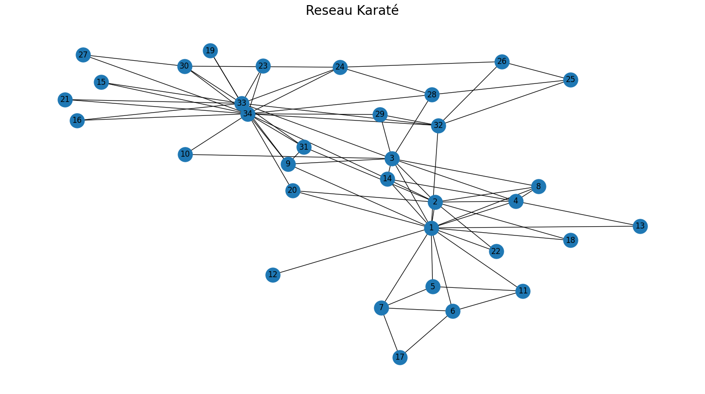
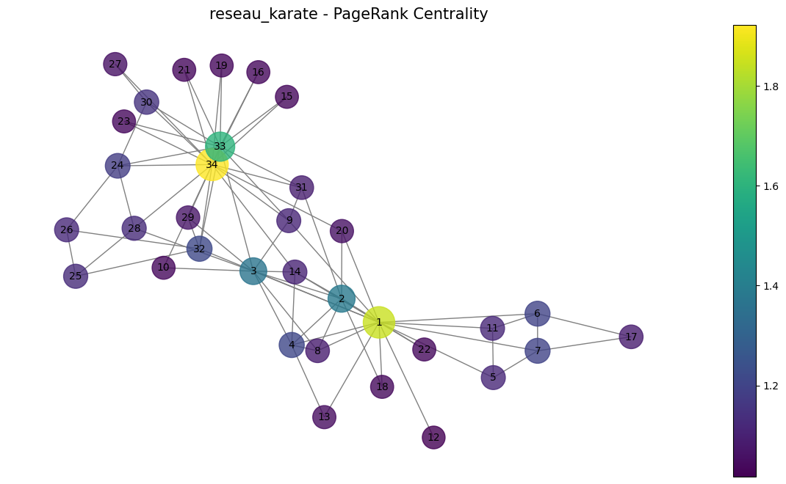
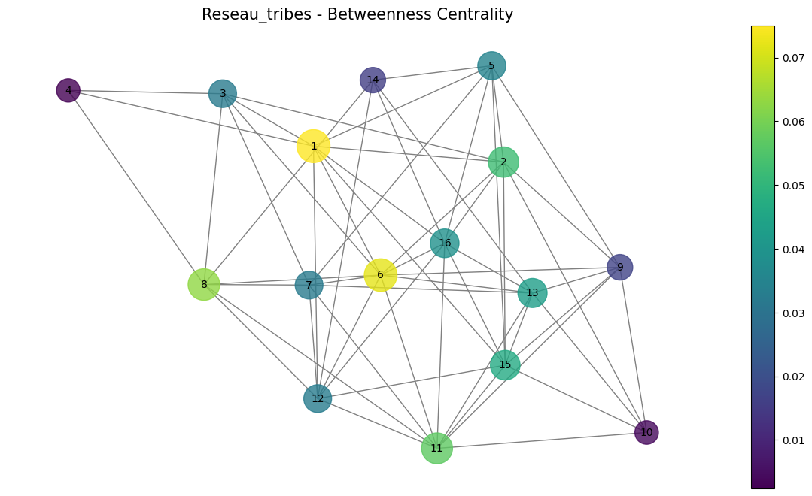

# Mesures de centralité dans les réseaux sociaux

Qui compte, dans un réseau ? La question n'a pas une réponse mais plusieurs, selon ce qu'on entend par « compter ». Ce projet compare les principales mesures de centralité sur trois réseaux réels.

## Les trois mesures, et ce qu'elles disent

**Centralité de degré** — le nombre de liens. La plus simple : est populaire celui qui a beaucoup de connexions directes. Mesure l'influence immédiate, sur le voisinage.

**Centralité de proximité** — l'inverse de la distance moyenne aux autres. Est central celui qui peut atteindre tout le monde rapidement. Mesure l'efficacité de diffusion : une information partie de ce nœud se propage vite.

**Centralité d'intermédiarité** — le nombre de plus courts chemins qui passent par le nœud. Est central celui qui sert de pont. C'est la plus intéressante des trois, parce qu'elle identifie les nœuds dont la disparition **fragmente** le réseau — un individu peu connecté mais reliant deux communautés a une intermédiarité élevée et un degré faible.

Ces trois mesures désignent rarement les mêmes personnes, et l'écart entre elles est souvent plus instructif que leurs valeurs.

## Les réseaux étudiés

| Jeu | Nature |
| --- | --- |
| `soc-karate.txt` | Le club de karaté de Zachary : 34 membres, réseau devenu le cas d'école de la détection de communautés après la scission réelle du club en deux |
| `soc-physicians.txt` | Réseau de médecins et diffusion d'une innovation médicale |
| `soc-tribes.txt` | Relations entre tribus, avec liens positifs et négatifs |

Trois tailles et trois natures différentes, ce qui permet de voir si les conclusions tiennent ou dépendent du réseau.

## Visualisations







## Contenu du dépôt

| Chemin | Rôle |
| --- | --- |
| `projet_théorie_des_graphes.ipynb` | Chargement, calcul des centralités, comparaison, visualisation |
| `data/` | Les trois réseaux |
| `assets/` | Figures extraites du carnet |

## Exécution

```bash
pip install networkx matplotlib pandas numpy jupyter
jupyter notebook projet_théorie_des_graphes.ipynb
```

## Prolongements

Le vecteur propre et PageRank complèteraient naturellement le tableau : ils formalisent l'idée qu'être lié à quelqu'un d'important compte davantage qu'être lié à beaucoup de monde.

Sur le club de karaté, la comparaison la plus parlante consisterait à confronter les nœuds les plus centraux à la scission réellement observée — le réseau est connu précisément parce que la structure prédit le résultat.
